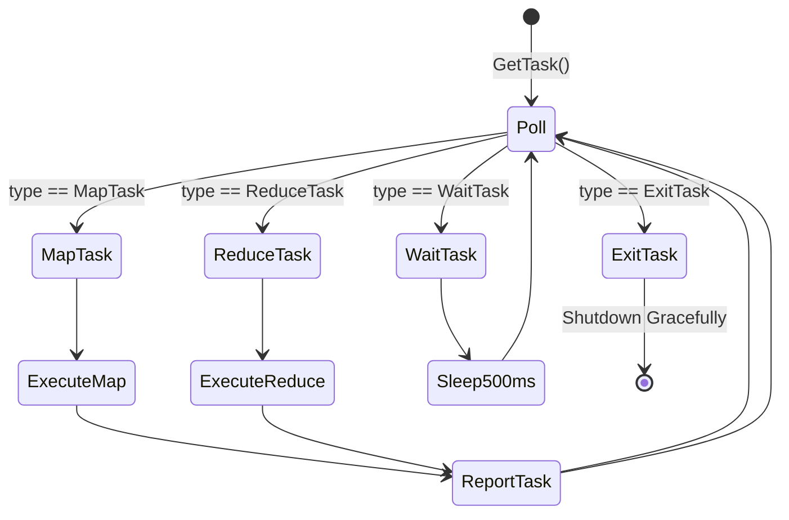
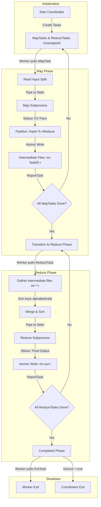

# MapReduce Task Pulling and Execution Lifecycle

This document provides a technical deep-dive into how worker nodes pull tasks from the coordinator and how the overall MapReduce operation is executed across the cluster.

---

## 🛰️ 1. How Workers Pull Tasks (The Pull Model)

The system uses a **pull-based scheduling model** where workers periodically poll the coordinator for work. This prevents the coordinator from having to track active worker connection states or push tasks to potentially dead workers.

### The Polling Loop (`Worker.Run`)
When a worker starts:
1. It initializes a persistent gRPC client connection to the coordinator.
2. It enters a continuous `for` loop in `Worker.Run()` and requests work by calling the `GetTask` RPC.
3. Based on the coordinator's response, the worker acts on one of four control signals:

### Coordinator-Side Scheduling (`AssignTask`)
When the coordinator receives a `GetTask` RPC, it executes `AssignTask()`, which decides what work (if any) to distribute:

1. **Concurrency Control**: The coordinator acquires a mutex lock (`c.mu.Lock()`) to guarantee that state checks, task assignments, and phase updates are strictly thread-safe.
2. **Phase Assessment**:
   * **`MapPhase`**: 
     - It loops through the list of `mapTasks`.
     - A task is selected if its state is `Unassigned`, OR if it is `InProgress` but the current time has exceeded the timeout threshold (**10 seconds**).
     - If an `InProgress` task is reassigned, it increments the `speculativeExecutions` metric (since a slow worker might still be working on it).
     - It marks the task state as `InProgress`, updates `AssignedAt = time.Now()`, and returns a `MapTask` assignment.
     - If all map tasks are not completed but no tasks are ready to assign (i.e. they are all `InProgress` within the timeout window), it returns a `WaitTask`, telling the worker to back off and try again later.
     - If all map tasks are completed, the coordinator transitions the phase to `ReducePhase`.
   * **`ReducePhase`**:
     - It applies the same scanning, assignment, and timeout rules to `reduceTasks`.
     - If all reduce tasks are not completed but none are assignable, it returns a `WaitTask`.
     - If all reduce tasks are completed, it transitions the phase to `CompletedPhase` and returns an `ExitTask`.
   * **`CompletedPhase`**:
     - Returns `ExitTask` immediately.
3. **Wait & Exit Actions**:
   * If a worker receives a `WaitTask`, it sleeps for **500ms** before calling `GetTask` again.
   * If a worker receives an `ExitTask`, it breaks its polling loop and exits gracefully.

---

## 🔄 2. The Complete MapReduce Operation Lifecycle

A MapReduce job goes through distinct phases, coordinating data flow between input files, intermediate files, and final output files.

### Detailed Steps

#### Step 1: Job Initialization
* The user launches the **Coordinator** (passing input filenames and the number of reduce partitions `nReduce`).
* The coordinator starts a gRPC server and initializes lists tracking the state of all Map and Reduce tasks. All tasks start in the `Unassigned` state.

#### Step 2: Map Phase Execution
* Workers connect to the Coordinator and retrieve a `MapTask` containing a filename and a task ID.
* **Input Reading**: The worker reads the designated input file from the storage layer (either local disk or S3).
* **Subprocess Streaming**: The worker spawns a subprocess running the user's application script (e.g. a Python script) in `map` mode. It streams the raw input data into the subprocess's `stdin`.
* **Output Parsing**: The subprocess writes tab-separated key-value pairs (`key\tvalue\n`) to its `stdout`. The worker parses this stream.
* **Partitioning**: For each key-value pair, the worker computes the destination partition partition index `r` using:
  $$\text{partition} = \text{ihash}(key) \pmod{nReduce}$$
* **Atomic Writes**: The worker accumulates key-value pairs for each partition buffer and writes them to intermediate files named `mr-TaskID-r`. Writes are completed atomically (using temporary files renamed upon success) to avoid dirty writes from crashed workers.
* **Task Reporting**: Once all files for the task are written, the worker sends a `ReportTask` RPC to the coordinator, which changes the task's state to `Completed`.

#### Step 3: Phase Transition
* The coordinator does not start dispatching reduce tasks until all map tasks have been completed.
* Once the final `MapTask` is reported finished, the coordinator transitions its state to `ReducePhase`.

#### Step 4: Reduce Phase Execution
* Workers poll the coordinator and receive a `ReduceTask` for partition index `r`.
* **Intermediate File Gathering**: The worker queries the storage layer to list all files starting with `mr-`. It filters for files that end with `-r` (e.g., `mr-0-r`, `mr-1-r`, etc.).
* **Merge & Sort**: The worker reads all intermediate files for partition `r`, collects all key-value pairs, and sorts them alphabetically by key. This grouping is critical so that all values for a given key are processed together.
* **Subprocess Streaming**: The worker spawns the app subprocess in `reduce` mode. It feeds the sorted key-value list through `stdin`.
* **Output & Storage**: The subprocess aggregates values for each unique key and writes the finalized reduce outputs to `stdout`. The worker writes this output atomically to the final file `mr-out-r`.
* **Task Reporting**: The worker reports the task finished, and the coordinator marks Reduce Task `r` as `Completed`.

#### Step 5: Termination
* Once all reduce tasks are finished, the coordinator transitions to `CompletedPhase`.
* Polling workers receive an `ExitTask` and shut down.
* The coordinator's `IsDone()` function returns `true`, and the main coordinator process exits cleanly.

---

## 🛡️ 3. Concurrency and Fault Tolerance Mechanisms

* **State Mutex**: The coordinator protects all of its internal arrays and state variables behind a single mutex (`sync.Mutex`), preventing race conditions when multiple workers call `GetTask` or `ReportTask` concurrently.
* **10-Second Worker Timeout**: If a worker crashes or runs too slowly, the coordinator detects that `time.Since(task.AssignedAt) > 10 * time.Second` and will re-assign that task to another worker.
* **Atomic Write Safety**: The storage engine writes data to a temporary file (e.g., `tmp-filename`) and renames it to the target name (e.g., `mr-0-r`) only after the write completes successfully. This ensures that even if a worker crashes mid-write or a timed-out worker writes late, no corrupted or partial files are ever read by the reduce phase.
