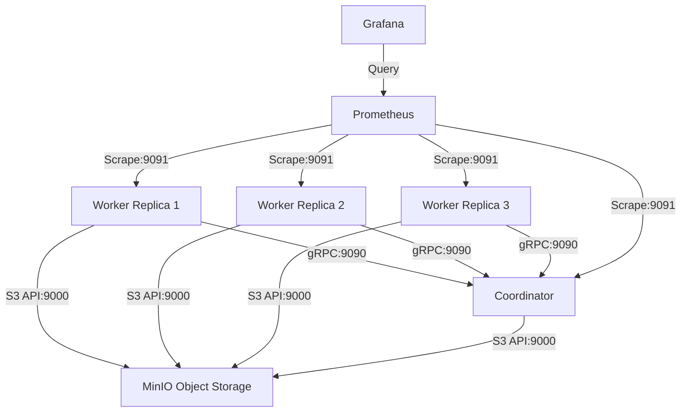

# MapReduce Docker Compose Configuration & Architecture

This document provides a detailed overview of the Docker Compose orchestration layer used to build, deploy, and monitor the MapReduce cluster.

---

## 1. Services Architecture

The system uses **5 integrated services** defined in `deployments/docker/docker-compose.yml` to orchestrate a distributed MapReduce job with S3 object storage and real-time Prometheus/Grafana monitoring.



### A. Shared Storage: MinIO (`minio`)
* **Role:** An S3-compatible object storage server replacing a traditional distributed filesystem (like HDFS).
* **Ports:** 
  * `9000`: S3 API endpoint.
  * `9001`: Web administration console UI.
* **Health Check:** Includes a healthcheck instruction `mc ready local` to verify that MinIO is fully initialized and operational before other services start up.

### B. MapReduce Coordinator (`coordinator`)
* **Role:** Runs the gRPC scheduler.
* **Build Target:** Built using `deployments/docker/Dockerfile.coordinator`.
* **Command:** `--storage s3 --s3-endpoint minio:9000` tells the coordinator to upload inputs and manage job scheduling using MinIO.
* **Port Mappings:**
  * `9090:9090`: Exposes gRPC API for worker communication.
  * `9091:9091`: Exposes Prometheus metrics.

### C. MapReduce Workers (`worker`)
* **Role:** Run the task executing daemons.
* **Replication:** Configured to launch **3 replicas** by default.
* **Command:** `--coordinator-addr coordinator:9090 --app /app/examples/wordcount.py --storage s3 --s3-endpoint minio:9000`. Runs the `wordcount.py` streaming application script.
* **Dependencies:** Depends on the `coordinator` service to ensure gRPC is ready before starting the polling loop.

### D. Monitoring Stack (`prometheus` & `grafana`)
* **Prometheus (`prometheus`):** Scrapes metric targets from the coordinator and worker endpoints. Maps host port `9092` to container port `9090`.
* **Grafana (`grafana`):** Provides a visual dashboard to monitor cluster throughput, active workers, task execution times, and failures. Maps host port `3000`.

---

## 2. Cluster Deployment & Scale-up Commands

To launch and scale the MapReduce cluster:

### Start the Cluster
To build the Docker images and start the entire cluster in the background:
```bash
docker compose -f deployments/docker/docker-compose.yml up --build -d
```

### Scale the Worker Nodes
You can scale the number of worker nodes dynamically. For example, to run the job with 5 parallel workers:
```bash
docker compose -f deployments/docker/docker-compose.yml up -d --scale worker=5
```

### View Cluster Logs
To monitor progress and execution output:
```bash
docker compose -f deployments/docker/docker-compose.yml logs -f
```

### Stop the Cluster and Clear Volumes
To tear down the containers and delete the associated volumes (MinIO data and Grafana databases):
```bash
docker compose -f deployments/docker/docker-compose.yml down -v
```
