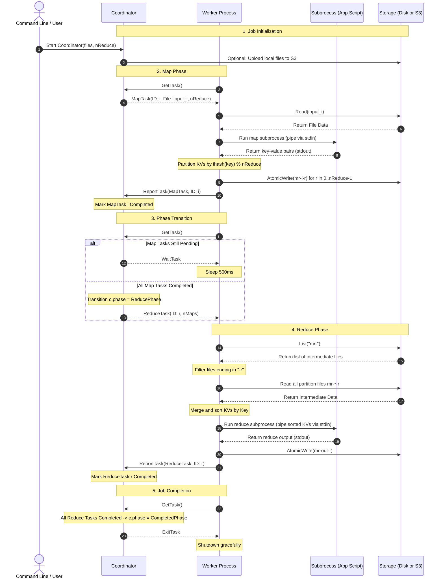

# MapReduce Execution Flow & Lifecycle

This document provides a detailed walkthrough of the complete MapReduce job lifecycle, demonstrating how the coordinator, workers, and storage layers interact.

---

## 1. Sequence Diagram

The following sequence diagram outlines the process from job startup through to completion:

---

## 2. Step-by-Step Execution Details

### 1. Job Initialization
* The coordinator starts by parsing input files and `--nreduce` partitions.
* If using S3 storage, it uploads local input splits to the bucket and maps them to clean object names.
* Instantiates lists of Map and Reduce task states, initially set to `Unassigned`.

### 2. Map Phase
* A worker calls the coordinator's gRPC `GetTask` RPC.
* The coordinator searches its `mapTasks` for any `Unassigned` task. It sets its state to `InProgress` and records the assignment time.
* The worker downloads the specified split from storage, reads the content, and spawns the Map subprocess (specified by `--app`) in `map` mode.
* The worker pipes the split data into the subprocess's `stdin`. The subprocess executes the user's Map logic and emits `key\tvalue` pairs on `stdout`.
* The worker parses these pairs, computes the target reduce partition `r = ihash(key) % nReduce`, and appends them to local buffers.
* For each partition `r`, the worker writes the intermediate keys to a file named `mr-TaskID-r` using `AtomicWrite` to guarantee file system consistency.
* Finally, the worker invokes `ReportTask` to notify the coordinator.

### 3. Phase Transition & Waiting
* If a worker asks for a task but some Map tasks are still in progress, the coordinator returns a `WaitTask` assignment, prompting the worker to sleep for 500ms and try again.
* Once the coordinator detects that all Map tasks are `Completed`, it transitions `c.phase = ReducePhase`.

### 4. Reduce Phase
* The coordinator responds to a worker's `GetTask` call with a `ReduceTask` for partition `r`.
* The worker queries storage for all intermediate files prefixed with `mr-` and selects those whose names match the target partition `r` (e.g. `mr-*-r`).
* It reads all matching files, aggregates all key-value records, and sorts them alphabetically by key.
* The worker spawns the Reduce subprocess in `reduce` mode and feeds the sorted records through its `stdin`.
* The subprocess aggregates values for each unique key, executes the user's Reduce logic, and writes the output values to `stdout`.
* The worker writes the final output to `mr-out-r` using `AtomicWrite` and reports the task completed.

### 5. Job Completion & Termination
* When all reduce tasks are marked `Completed`, the coordinator sets `c.phase = CompletedPhase`.
* Any subsequent `GetTask` request receives an `ExitTask`, instructing workers to shut down.
* The coordinator's `IsDone()` returns `true`, allowing the coordinator process to exit.
