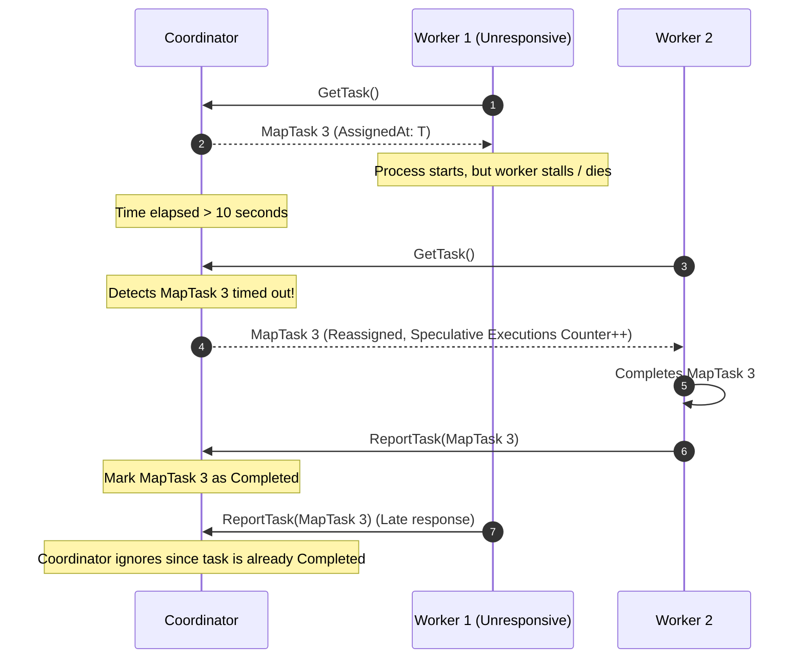

# MapReduce Orchestration & Fault Tolerance Guide

This document outlines the fault-tolerance guarantees and task orchestration recovery mechanisms built into the MapReduce system.

---

## 1. Resilient Scheduling & Task Re-execution

In a distributed environment, worker nodes can crash, freeze, or suffer from severe network degradation. The MapReduce coordinator provides resilience against these failure scenarios using **speculative re-execution**.

### Timeout Detection & Rescheduling
* **Tracking In-Progress Tasks:** When a task (either Map or Reduce) is assigned, the coordinator updates its state to `InProgress` and records the timestamp in `AssignedAt`.
* **The 10-Second Threshold:** When any worker polls for a task, the coordinator iterates through the task list. If it finds a task that has been `InProgress` for longer than **10 seconds**, it assumes the assigned worker has failed or stalled.
* **Speculative Re-execution:** The coordinator increments the `mapreduce_coordinator_speculative_executions_total` counter and immediately reassigns that same task to the polling worker.

### Idempotency of Task Completion
* Because multiple workers might be executing the same task (e.g. if a worker was merely slow rather than crashed), the coordinator must handle redundant completion reports.
* The `CompleteTask()` method evaluates the state of the reported task.
  * If the task's recorded state in the coordinator is `InProgress`, it changes the state to `Completed` and updates the completion metrics.
  * If the task's state is already `Completed` (because a different worker finished and reported it first), the late report is discarded.

---

## 2. Storage Atomicity & Write Safety

If a worker crashes while writing intermediate or final outputs, we must prevent partial or corrupted files from being read by subsequent phases. The storage adapter handles this by enforcing atomic file system operations.

### Local Disk Storage (`AtomicWrite`)
* **Create Temp File:** The worker first writes the output bytes to a temporary staging file created with a unique pattern (e.g., `mr-atomic-*`) in the target directory.
* **Flush and Sync:** It calls `.Sync()` on the file descriptor to ensure the operating system flushes all write buffers to the physical storage media.
* **Atomic Rename:** The worker closes the file and calls `os.Rename(tmpPath, fullPath)`. On POSIX systems, `rename` is atomic. This guarantees that other workers checking for intermediate files (e.g. `mr-*-r` during the Reduce phase) will only see fully-written files, and never corrupted partial files from a crashed worker.
* **Cleanup:** The defer block ensures that if any write or sync error occurs, the temporary file is deleted.

### S3 Object Storage
* When configured to use `s3` storage, the worker writes outputs directly to an S3 bucket.
* The S3 adapter utilizes multipart or single PUT operations. S3 guarantees read-after-write consistency and atomic visibility of objects: an object is only visible in the bucket bucket namespace once the upload completes. Incomplete uploads do not pollute the bucket namespace.
