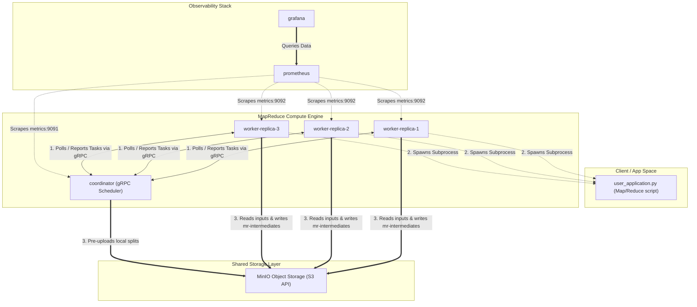

# Distributed MapReduce Cluster

A production-grade, containerized, and fault-tolerant distributed MapReduce system built in Go, using gRPC for transport, MinIO (S3-compatible API) as a shared storage layer, and an isolated streaming runner for executing user-defined Map/Reduce scripts (e.g. Python scripts).

---

## Quickstart

### 1. Start the Cluster
Run the automation script from the repository root to compile the Go binaries, initialize environment configuration, and boot up the Docker Compose cluster (including workers, storage, and monitoring stack):

```bash
./deploy.sh
```

---

## System Architecture & Wire Diagram

The following diagram represents the network topology, component communication, and monitoring scrape-paths of the MapReduce cluster:



---

## Observability & Monitoring

Once deployed via `./deploy.sh`, you can access the following local endpoints:

*   **Grafana Dashboards**: [http://localhost:3000](http://localhost:3000) (Login: `admin` / `admin`)
*   **Prometheus Metrics**: [http://localhost:9092](http://localhost:9092)
*   **MinIO Console UI**: [http://localhost:9001](http://localhost:9001) (Login: `minioadmin` / `minioadmin`)
*   **Coordinator gRPC**: `localhost:9090`
